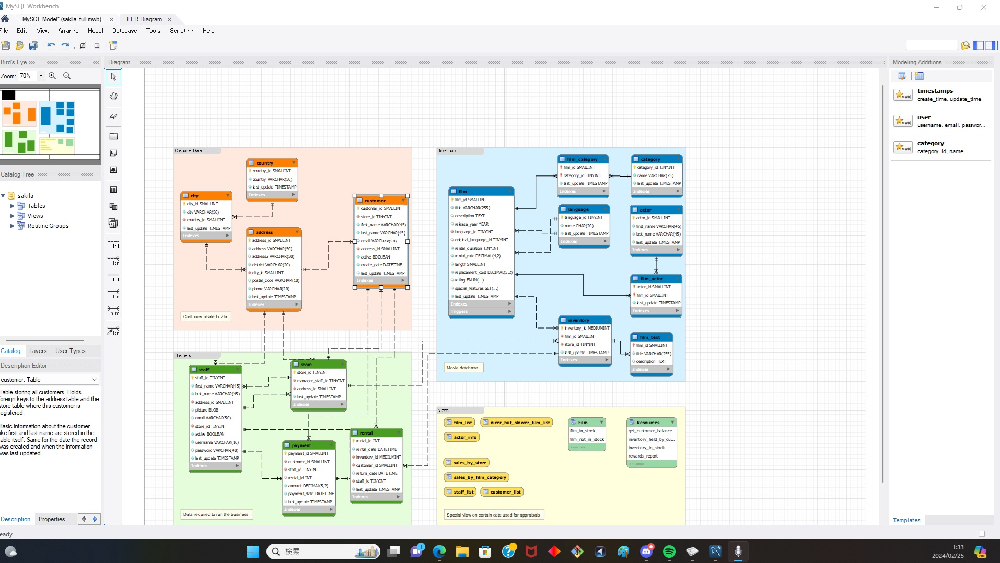

# EngineersGate-SQL

## EngineersGate SQLオリジナル課題

SQLオリジナル課題制作物になります。

## 目的

SQLオリジナル課題制作物として、下記課題を行いました。

1. MySQLをインストールしましょう
2. MySQLに接続してみましょう
3. データベースを作成しましょう
  ```sql
 /* 3.データベース作成 */
CREATE SCHEMA `sample_db` ;
```
4. テーブルを作成しましょう
```sql
 CREATE TABLE `sample_db`.`user` (
 `id` INT NOT NULL AUTO_INCREMENT, /* ユーザーID: 自動増加する一意の識別子 */
 `name` VARCHAR(45) NOT NULL COMMENT '名前', /* 名前: ユーザーの姓名を格納 */
 `birthday` DATE NULL COMMENT '誕生日', /* 誕生日: ユーザーの生年月日を記録 */
 `height` INT NULL COMMENT '身長', /* 身長: 単位はセンチメートルで記録 */
 `weight` INT NULL COMMENT '体重', /* 体重: 単位はキログラムで管理 */
);
``` 
5. 作成したテーブルにレコードの登録・更新・削除を行ってみましょう
```sql
INSERT INTO `sample_db`.`user` (`name`, `birthday`, `height`, `weight`)
VALUES ('田中 太郎', '1990-05-21', 175, 65);
UPDATE `sample_db`.`user`
SET `height` = 180, `weight` = 68
WHERE `id` = 1;
DELETE FROM `sample_db`.`user`
WHERE `id` = 1;
```
6. MySQL Workbenchをインストールしましょう
7. MySQL Workbenchで、作成したデータベースに接続しましょう
8. MySQL Workbenchで、ER図を作成してみましょう!


9. 作成したER図よりCreate文を生成してみましょう
 ```sql
-- countryテーブルのCREATE文
CREATE TABLE country (
  country_id SMALLINT NOT NULL AUTO_INCREMENT,
  country VARCHAR(50),
  last_update TIMESTAMP,
  PRIMARY KEY (country_id)
);

-- cityテーブルのCREATE文
CREATE TABLE city (
  city_id SMALLINT NOT NULL AUTO_INCREMENT,
  city VARCHAR(50),
  country_id SMALLINT NOT NULL,
  last_update TIMESTAMP,
  PRIMARY KEY (city_id),
  FOREIGN KEY (country_id) REFERENCES country (country_id)
);

-- addressテーブルのCREATE文
CREATE TABLE address (
  address_id SMALLINT NOT NULL AUTO_INCREMENT,
  address VARCHAR(50),
  address2 VARCHAR(50),
  district VARCHAR(20),
  city_id SMALLINT NOT NULL,
  postal_code VARCHAR(10),
  phone VARCHAR(20),
  last_update TIMESTAMP,
  PRIMARY KEY (address_id),
  FOREIGN KEY (city_id) REFERENCES city (city_id)
);

-- customerテーブルのCREATE文
CREATE TABLE customer (
  customer_id SMALLINT NOT NULL AUTO_INCREMENT,
  store_id TINYINT NOT NULL,
  first_name VARCHAR(45),
  last_name VARCHAR(45),
  email VARCHAR(50),
  address_id SMALLINT NOT NULL,
  active BOOLEAN,
  create_date DATE,
  last_update TIMESTAMP,
  PRIMARY KEY (customer_id),
  FOREIGN KEY (address_id) REFERENCES address (address_id),
  FOREIGN KEY (store_id) REFERENCES store (store_id)
);
```
10. MySQL WorkbenchでSNSサイトを作成する上で必要なテーブル構成を設計（ER図を作成する）してみましょう


